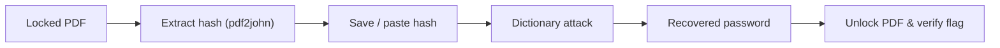

<div align="center">

# Cybersecurity Lab Report: PDF Password Recovery & Hash Analysis

[](https://www.linkedin.com/in/ali-abbas-qazi/)
[](https://github.com/Ali-Abbas-Qazi)

*Lab exercise using a training file provided by Networkwalks Academy — not a real-world engagement.*

</div>

| | |
|---|---|
| **Date** | September 2026 |
| **Author** | Ali Abbas Qazi |
| **Tools Used** | John the Ripper (Jumbo v1.9.0-jumbo-1), Johnny GUI v2.2, OnlineHashCrack PDF Hash Extractor, Networkwalks Hash Calculator, Networkwalks Password Cracker, Adobe Acrobat Reader DC |
| **Category** | Defensive Security · Cryptanalysis · Identity Security |

---

## Table of Contents

- [Executive Summary](#executive-summary)
- [Skills Demonstrated](#skills-demonstrated)
- [Workflow Overview](#workflow-overview)
- [Core Security Principles](#core-security-principles)
- [Task 1: Local Cracking with John the Ripper & Johnny GUI](#task-1-local-cracking-with-john-the-ripper--johnny-gui)
- [Task 2: Browser-Based Extraction & Cracking with Networkwalks Tools](#task-2-browser-based-extraction--cracking-with-networkwalks-tools)
- [Comparing the Two Approaches](#comparing-the-two-approaches)
- [Security Implications & Remediation](#security-implications--remediation)
- [Lessons Learned](#lessons-learned)

---

## Executive Summary

This lab walks through two ways of recovering a password from an encrypted PDF: a local, offline approach using John the Ripper and its Johnny GUI, and a browser-based approach using Networkwalks' free hash and cracking tools. Both start from the same locked file and end at the same password, but they get there through very different workflows.

The point isn't the specific password recovered here. It's what the exercise demonstrates: a password's strength is really a measure of how long it survives against automation. A one-word, all-lowercase password can be tested against thousands of guesses in seconds, whether you're running dedicated cracking software or just pasting a hash into a website. That has a direct business implication — password policy and entropy requirements aren't bureaucratic overhead, they're the difference between a document that holds up under attack and one that doesn't.

## Skills Demonstrated

- Hash extraction from encrypted documents (`pdf2john` and browser-based hash calculators)
- Offline vs. cloud-based cracking tradeoffs, including data-handling and privacy implications
- Dictionary attack methodology and wordlist-based password recovery
- PDF encryption fundamentals (security handler revisions, key length)
- Tooling: John the Ripper (Jumbo), Johnny GUI, browser-based cracking utilities
- Technical documentation and security reporting for a non-specialist audience

## Workflow Overview

Both tasks follow the same underlying process, just with different tools at each stage:



---

## Core Security Principles

### Encryption vs. Hashing

These two terms get mixed up constantly, so it's worth being precise. **Encryption** is two-way: data is scrambled with a key, and the same (or a related) key reverses the process. Password-protected PDFs use encryption to lock their contents — you need the right password to decrypt and read them.

**Hashing** is one-way. A hash function takes an input and produces a fixed-length digest that can't be reversed back into the original value. PDFs don't store your plaintext password anywhere; they store data derived from it (salts, check values, iteration counts) that a cracking tool can use to *test* password guesses without ever "decrypting" the hash itself.

### How Password-Protected PDFs Expose Their Hashes

A PDF's security handler stores metadata in the file structure that describes how it was encrypted: the algorithm, key length, revision number, and cryptographic values needed to verify a password attempt. Tools built around `pdf2john` (the utility both OnlineHashCrack and Networkwalks' Hash Calculator use under the hood) parse this metadata out of the file and reformat it into a single line that John the Ripper or Hashcat can process — something like `$pdf$4*4*128*-1060*...`. Critically, this extraction never touches the actual encrypted content of the document. It just reads structural metadata, which is why it works even without knowing the password.

### Dictionary Attacks

A dictionary attack tests a list of candidate passwords, one at a time, against the extracted hash. If the real password is a common word, a name, a keyboard pattern, or anything that shows up in a breach-derived wordlist, it gets found almost immediately — no brute force required. This is exactly what makes weak passwords dangerous: an attacker doesn't need to guess blindly across the whole possible keyspace. They just need a wordlist and a few seconds of compute.

---

## Task 1: Local Cracking with John the Ripper & Johnny GUI

### Step 1 — Extracting the Hash

I ran the locked file through OnlineHashCrack's PDF Hash Extractor, which uses `pdf2john` on the back end. The file gets uploaded to their service for parsing (worth noting for anything sensitive — more on that in the comparison below), and the tool returns a crackable hash in standard JTR/Hashcat format.


### Step 2 — Preparing the Hash File

The extracted hash gets saved locally as `hash1.txt`, in the exact format John the Ripper expects:

```
$pdf$4*4*128*-1060*1*16*55d1a5c14175da449753199e44971d32*32*777fd021a7f3c5ae598c0c6495c7f76e00000000000000000000000000000000*32*ceecdac74b19b5a62688d3b3524e1374c955cbb9cc3c45316494d9446ef81af1
```

One thing that's easy to miss here: if the hash gets copied with stray characters (a leading `b'`, for example, which shows up if it was copied out of a Python byte string), John the Ripper won't recognize the format. It has to start clean, right at `$pdf$`.


### Step 3 — Loading the Hash into Johnny

With `hash1.txt` saved, I opened Johnny (pointed at the `john.exe` binary from the Jumbo build) and imported the password file. Before the attack starts, Johnny shows the hash sitting at 0% cracked, format detected as PDF.


### Step 4 — Cracking and Verifying

Starting the attack, Johnny made short work of it — the password recovered was `password1`.


> **Flag captured:** `nw{networkwalks_flag1_jtr_270521_1}`

Opening the original PDF in Adobe Acrobat Reader with the recovered password confirmed the crack and revealed the flag.


---

## Task 2: Browser-Based Extraction & Cracking with Networkwalks Tools

### Step 1 — Hash Calculation in the Browser

For the second approach, I used Networkwalks' own Hash Calculator. Unlike OnlineHashCrack, this tool parses the PDF client-side — nothing gets uploaded to a server, which is a meaningful difference if you're working with anything you'd rather not send anywhere.


### Step 2 — Running the Dictionary Attack

I pasted the extracted `$pdf$` hash into Networkwalks' Password Cracker and ran it against the tool's built-in 100-word list. It matched `password1` after 91 attempts at roughly 9 passwords per second — under 10 seconds, start to finish, against a wordlist smaller than most people's contact lists.


### Step 3 — Confirming Access

Same as before: entering `password1` into the encrypted PDF opened it and confirmed the flag.


---

## Comparing the Two Approaches

| Category | Offline (JTR + Johnny) | Browser-Based (Networkwalks) |
|---|---|---|
| **Setup Complexity** | Requires downloading and configuring John the Ripper and Johnny locally — a one-time setup with a few more moving parts. | Nothing to install; extraction and cracking both run in the browser. |
| **Privacy & Data Security** | The file and hash never leave your machine. Best option for anything sensitive. | Depends on the specific tool — Networkwalks' Hash Calculator parses locally, but the OnlineHashCrack extractor used in Task 1 uploads the file to a third-party server. |
| **Cracking Performance & Scalability** | Supports custom wordlists, mangling rules, and GPU-accelerated modes via Hashcat — scales to real workloads. | Limited to a fixed 100-word built-in list in this tool; not built for custom lists or heavier compute. |
| **Best Use Case** | Real assessments, sensitive client data, larger cracking jobs. | Quick demos, training labs, and teaching password hygiene with zero setup. |

---

## Security Implications & Remediation

### Why `password1` Fell Instantly

There's nothing complicated about why this password broke so fast: it's a dictionary word with a single digit appended, no symbols, no mixed case beyond the default, and a pattern (`word` + `number`) that's near the top of every common-password list ever compiled. Low entropy means a small search space, and a small search space means automated tools will find it in seconds rather than years.

### Fixing It — A Blue Team Perspective

- **Minimum length and complexity standards.** Twelve characters with mixed case, numbers, and symbols pushes a password out of dictionary-attack range and into brute-force territory, where the math starts working in the defender's favor.
- **Password managers.** They remove the incentive to reuse short, memorable passwords across documents and accounts, since nobody has to remember a randomly generated string.
- **Multi-factor authentication.** Where it's supported, MFA means a cracked password alone isn't enough to get in — though PDF encryption itself doesn't currently support this, it's the standard for account-level access.
- **Modern encryption revisions.** Older PDF security handlers (like the R4/128-bit revision used in this lab) are weaker than newer AES-256-based revisions. Where possible, use tools that default to the strongest available PDF encryption standard.

---

## Lessons Learned

Comparing the two workflows made the tradeoff between convenience and control more concrete than I expected going in. The difference between the Networkwalks Hash Calculator parsing locally and OnlineHashCrack uploading the file to a server was a detail I almost skipped past — until I realized it's exactly the kind of choice that matters once you're handling something you can't afford to leak. If I ran this again, I'd time both cracks precisely instead of estimating from the pw/s counter, and I'd swap in a larger wordlist to see how far a genuinely weak password like `password1` sits below the point where cracking starts taking real effort.
